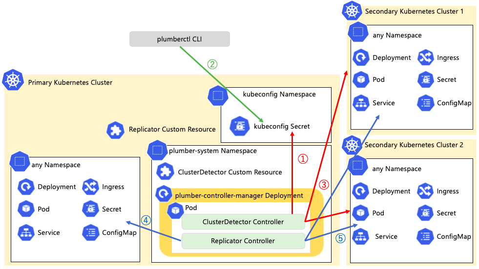

# plumber
Operator to replicate resources between Kubernetes clusters.

## Introduce
Please watch the following video first.

https://github.com/jnytnai0613/plumber/assets/31709999/10453fc6-eebf-49a5-9507-bb09df81e260

Next, Architecture is explained.

1. When plumber-controller-manager is started, ClusterDetector Controller creates a Client based on the authentication information of ServiceAccount. At this time, kubeconfig information is generated from the Client and a Secret is created.In addition, the PrimaryCluster is also registered with ClusterDetector Custom Resource.<br>
2. plumberctl CLI is also implemented. 
kubeconfig information of Secondary Cluster specified by plumberctl CLI is extracted from the kubeconfig file of the terminal to be executed and added to Secret.
3. The ClusterDetector Controller monitors the Secret.
Whenever there is an update to the Secret, it is read in real-time and the ClusterDetector Custom Resource is also updated to add or remove Secondary Clusters.
4. The Plumber Custom Resource contains the namespace name to be replicated, the Secondary Cluster name, and the resource definition.
When a Plumber Custom Resource is deployed, Plumber Controller reads the .Spec field and creates the namespace and the resource to be replicated in the Primary Cluster.
5. Then, create a namespace and resources for the Secondary Cluster as well.

## Road Map
This Operator may make destructive changes to the code in the future.
- [ ] Automatic release of plumberctl CLI
- [ ] Resource replication specifying existing namespace
- [ ] Best Effort: Support distributed tracing with OpenTelemetry

## Automatic creation and replication of Kubernetes resources.
1. Primary and Secondary Cluster Detection  
   - A clusterdetector resource is automatically created by the Operator to perform cluster detection.
2. Replication of the following resources is supported
   - Creation of the following kuberndtes resources
     - ConfigMap
     - Deployment
     - Service
     - Ingress
   - The following resources are automatically created when SSL is enabled in Ingress.
     - Secret1: Data contains CA certificate, server certificate and private key required for SSL termination of Ingress
     - Secret2: Client certificate and private key required for access to Ingress in data

## Primary and Secondary cluster detection
When the Operator is deployed, the clusterdetector resource is automatically created as shown below.  
Replication is performed using the clusterdetector resource.
```
kubectl -n plumber-system get clusterdetectors -owide --show-labels
NAME                              CONTEXT      CLUSTER         USER                CLUSTERSTATUS   REASON   AGE   LABELS
v1252-cluster.kubernetes-admin3   secondary2   v1252-cluster   kubernetes-admin3   Running                  37h   app.kubernetes.io/role=secondary
v1262-cluster.kubernetes-admin2   secondary1   v1262-cluster   kubernetes-admin2   Running                  37h   app.kubernetes.io/role=secondary
kubernetes.kubernetes-admin       primary      kubernetes      kubernetes-admin    Running                  37h   app.kubernetes.io/role=primary
```

## yaml example
Replication can be performed by applying the following yaml file and creating a replicator resource.The namespace to be replicated is entered in the replicationNamespace field, and the secondary cluster to be replicated to is entered in the targetCluster field.　In this
case, Server-Side Apply is used for replication, and the Applyconfiguration is embedded in the following replicator resource definitions 
so that they can be defined in the same way as in the usual Deployment definitions.In addition, the replicator resource is a Cluster-wide resource in order to manage multiple namespaces.
```yaml
apiVersion: plumber.jnytnai0613.github.io/v1
kind: Replicator
metadata:
  labels:
    app.kubernetes.io/name: replicator
    app.kubernetes.io/instance: replicator-sample
    app.kubernetes.io/part-of: plumber
    app.kubernetes.io/managed-by: kustomize
    app.kubernetes.io/created-by: plumber
  name: replicator-sample
spec:
  targetCluster:
    - v1262-cluster.kubernetes-admin2
    - v1252-cluster.kubernetes-admin3
  replicationNamespace: "test-ns"
  deploymentName: nginx
  deploymentSpec:
    replicas: 3
    strategy:
      type: RollingUpdate
      rollingUpdate:
        maxSurge: 30%
        maxUnavailable: 30%
    template:
      spec:
        initContainers:
          - name: init
            image: alpine
            command: 
              - sh
              - -c
              - |
                cat << EOT > /tmp/run-nginx.sh
                apt-get update
                apt-get install inotify-tools -y
                nginx
                EOT
                chmod 500 /tmp/run-nginx.sh
                cat << EOT > /tmp/auto-reload-nginx.sh
                oldcksum=\`cksum /etc/nginx/conf.d/default.conf\`
                inotifywait -e modify,move,create,delete -mr --timefmt '%Y/%m/%d %H:%M:%S' --format '%T' /etc/nginx/conf.d/ | \
                while read date time; do
                    newcksum=\`cksum /etc/nginx/conf.d/default.conf\`
                    if [ ${newcksum} != ${oldcksum} ]; then
                        echo "At \${time} on \${date}, config file update detected."
                        oldcksum=\${newcksum}
                        service nginx restart
                    fi
                done
                EOT
                chmod 500 /tmp/auto-reload-nginx.sh
            volumeMounts:
            - name: nginx-reload
              mountPath: "/tmp/"
        containers:
          - name: nginx
            image: nginx:latest
            command:
              - bash
              - -c
              - "/tmp/run-nginx.sh && /tmp/auto-reload-nginx.sh"
            volumeMounts:
            - name: conf
              mountPath: "/etc/nginx/conf.d/"
            - name: index
              mountPath: "/usr/share/nginx/html/"
            - name: nginx-reload
              mountPath: "/tmp/"
        volumes:
        - name: conf
          configMap:
            name: "nginx"
            items:
              - key: "default.conf"
                path: "default.conf"
        - name: index
          configMap:
            name: "nginx"
            items:
              - key: "mod-index.html"
                path: "mod-index.html"
        - name: nginx-reload
          emptyDir: {}
  configMapName: nginx
  configMapData:
    default.conf: |
      server {
            listen 80 default_server;
            listen [::]:80 default_server ipv6only=on;
            root /usr/share/nginx/html;
            index index.html index.htm mod-index.html;
          server_name localhost;
      }
    mod-index.html: |
      <!DOCTYPE html>
      <html>
      <head>
      <title>Yeahhhhhhh!! Welcome to nginx!!</title>
      <style>
      html { color-scheme: light dark; }
      body { width: 35em; margin: 0 auto;
      font-family: Tahoma, Verdana, Arial, sans-serif; }
      </style>
      </head>
      <body>
      <h1>Yeahhhhhhh!! Welcome to nginx!!</h1>
      <p>If you see this page, the nginx web server is successfully installed and
      working. Further configuration is required.</p>
      <p>For online documentation and support please refer to
      <a href="http://nginx.org/">nginx.org</a>.<br/>
      Commercial support is available at
      <a href="http://nginx.com/">nginx.com</a>.</p>
      <p><em>Thank you for using nginx.</em></p>
      </body>
      </html>
  serviceName: nginx
  ##############################################################################
  ## Selector is automatically assigned by the controller and is not required.
  ##############################################################################
  serviceSpec:
    type: ClusterIP
    ports:
    - protocol: TCP
      port: 80
      targetPort: 80
  
  ingressName: nginx
  ingressSpec:
    rules:
    - host: nginx.example.com
      http:
        paths:
        - path: /
          pathType: Prefix
          backend:
            service:
              name: nginx
              port:
                number: 80
  ingressSecureEnabled: true
```

## Description to each field of CR
The CR yaml file is located in the config/samples directory.

### .spec.targetCluster
| Name            | Type     | Required      |
| --------------- | -------- | ------------- |
| targetCluster   | []string | false         |

### .spec.replicationNamespace
| Name                 | Type     | Required      |
| -------------------- | -------- | ------------- |
| replicationNamespace | string   | true          |

### .spec.deploymentSpec
| Name       | Type               | Required      |
| ---------- | ------------------ | ------------- |
| replicas   | int32              | false         |
| strategy   | DeploymentStrategy | false         |

Other fields cannot be specified.
Check the following reference for a description of the strategy field.  
https://kubernetes.io/docs/reference/kubernetes-api/workload-resources/deployment-v1/#DeploymentSpec

### .spec.deploymentSpec.template.spec.conatiners
| Name       | Type               | Required      |
| ---------- | ------------------ | ------------- |
| name       | string             | true          |
| image      | string             | true          |

The other fields are options.See the following reference for possible fields.  
https://kubernetes.io/docs/reference/kubernetes-api/workload-resources/pod-v1/#PodSpec

### .spec.serviceName
| Name           | Type               | Required      |
| -------------- | ------------------ | ------------- |
| serviceName    | string             | false         |

### .spec.serviceSpec
The serviceSpec field is required. 
However, selectors are automatically assigned by the controller and are not required. 
Check the following reference for a description of the serviceSpec field.  
https://kubernetes.io/docs/reference/kubernetes-api/service-resources/service-v1/

### .spec.ingressName
| Name           | Type               | Required      |
| -------------- | ------------------ | ------------- |
| ingressName    | string             | false         |

### .spec.ingressSpec
The ingressSpec field is required.
However, if TLS settings are to be made, the field does not need to be added, as it will be set automatically by setting ingressSecureEnabled to true, as described below.
Check the following reference for a description of the ingressSpec field.  
https://kubernetes.io/docs/reference/kubernetes-api/service-resources/ingress-v1/

## SSL Termination for Ingress
The following Secret is automatically created by setting the .spec.ingressSecureEnabled field in CustomResource to true.
```sh
NAME                         TYPE                DATA   AGE
secret/ca-secret             Opaque              3      32m
secret/cli-secret            Opaque              2      32m
```
TLS settings are also automatically added to Ingress.
- Add the following annotations to enable client authentication.
Each annotation is explained below.
https://github.com/kubernetes/ingress-nginx/blob/main/docs/user-guide/nginx-configuration/annotations.md#client-certificate-authentication
```json
$ kubectl -n test-ns get ingress nginx -ojson | jq '.metadata.annotations'
{
  "nginx.ingress.kubernetes.io/auth-tls-secret": "resource-replicator-system/ca-secret",
  "nginx.ingress.kubernetes.io/auth-tls-verify-client": "on",
  "nginx.ingress.kubernetes.io/rewrite-target": "/"
}
```
- Add the .spec.tls field.
Secret ca-secret is automatically created by the Controller and is automatically specified.
Also, hosts will automatically use the value specified in CustomResource's '.spec.ingressSpec.rules[].host'.
```json
$ kubectl  -n test-ns get ingress nginx -ojson | jq '.spec.tls'
[
  {
    "hosts": [
      "nginx.example.com"
    ],
    "secretName": "ca-secret"
  }
]
```
### Connection using Ingress
First, download the client certificate and private key from Secret cli-secret.
```sh
$ kubectl -n test-ns get secrets cli-secret -ojsonpath='{.data.client\.crt}' | base64 -d > client.crt

$ kubectl -n test-ns get secrets cli-secret -ojsonpath='{.data.client\.key}' | base64 -d > client.key
```
It can then be accessed with the following command
```sh
curl --key client.key --cert client.crt https://nginx.example.com:443/ --resolve nginx.example.com:443:<IP Address> -kv
```
The various certificates and private keys are generated by calling the functions in the following go file from the Controller.
https://github.com/jnytnai0613/resource-replicator/blob/main/pkg/pki/certificate.go

Since the -v option is given to curl, the CN specified in certificate.go can be confirmed.
```sh
*  subject: C=JP; O=Example Org; OU=Example Org Unit; CN=server
*  start date: Sep 26 03:21:24 2022 GMT
*  expire date: Dec 31 00:00:00 2031 GMT
*  issuer: C=JP; O=Example Org; OU=Example Org Unit; CN=ca
```

## Getting Started
You’ll need a Kubernetes cluster to run against. You can use [KIND](https://sigs.k8s.io/kind) to get a local cluster for testing, or run against a remote cluster.
**Note:** Your controller will automatically use the current context in your kubeconfig file (i.e. whatever cluster `kubectl cluster-info` shows).

### Prerequisite
- In this case, the cluster where Operator is deployed is considered Primary and the cluster where it is replicated is considered Secondary. Therefore, please prepare the Primary and Secondary clusters.
- The software listed in the following URL must be installed in advance
    - [NGINX ingress controller](https://kubernetes.github.io/ingress-nginx/deploy/)
    - if not already installed
        - make
        - gcc

### Running on the cluster
1. Build and push your image to the location specified by `IMG`:
```sh
export IMG=<some-registry>/plumber:tag
make docker-build docker-push
```

2. Deploy the controller to the cluster with the image specified by `IMG`:
```sh
export IMG=<some-registry>/plumber:tag
make deploy
```
Please refer to docs/plumberctl_usase.md for plumberctl CLI usage.

3. Install Instances of Custom Resources:
```sh
kubectl apply -f config/samples/plumber_v1_replicator.yaml
```

4. View cluster resources
View resources in the Primary cluster (where Operator is deployed)
For the namespace, please refer to CR's .spec.replicationNamespace　field.
```sh
kubectl -n <namespace name> get all,configmap,secret,ingress
```
The resources of the cluster to be replicated can be checked with the following command.
```sh
kubectl --context <context name> -n <namespace name> get all,configmap,secret,ingress
```

### Uninstall CRDs
To delete the CRDs from the cluster:

```sh
make uninstall
```

### Undeploy controller
UnDeploy the controller from the cluster:

```sh
make undeploy
```

### How it works
This project aims to follow the Kubernetes [Operator pattern](https://kubernetes.io/docs/concepts/extend-kubernetes/operator/).

It uses [Controllers](https://kubernetes.io/docs/concepts/architecture/controller/),
which provide a reconcile function responsible for synchronizing resources until the desired state is reached on the cluster.

### Test It Out
1. Install the CRDs into the cluster:

```sh
make install
```

2. Run your controller (this will run in the foreground, so switch to a new terminal if you want to leave it running):

```sh
make run
```

**NOTE:** You can also run this in one step by running: `make install run`

### Modifying the API definitions
If you are editing the API definitions, generate the manifests such as CRs or CRDs using:

```sh
make manifests
```

**NOTE:** Run `make --help` for more information on all potential `make` targets

More information can be found via the [Kubebuilder Documentation](https://book.kubebuilder.io/introduction.html)

## License

Copyright 2023.

Licensed under the Apache License, Version 2.0 (the "License");
you may not use this file except in compliance with the License.
You may obtain a copy of the License at

    http://www.apache.org/licenses/LICENSE-2.0

Unless required by applicable law or agreed to in writing, software
distributed under the License is distributed on an "AS IS" BASIS,
WITHOUT WARRANTIES OR CONDITIONS OF ANY KIND, either express or implied.
See the License for the specific language governing permissions and
limitations under the License.
